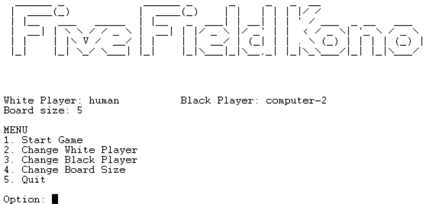
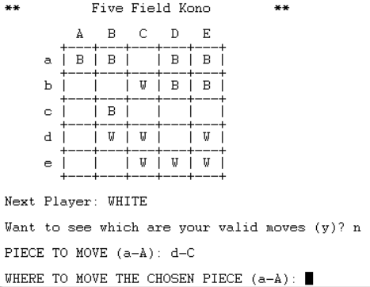
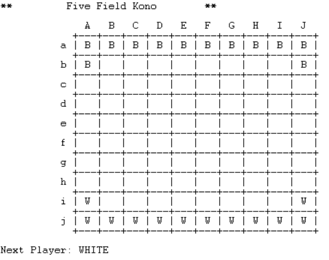
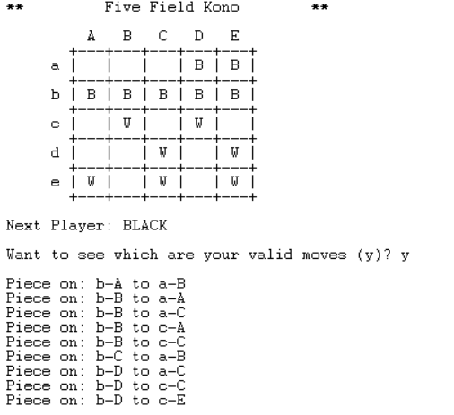

# Trabalho de Programação Lógica 2021

## Trabalho Five Field Kono - Grupo 3

André Diogo Bastos Pereira - up201905650
Matilde Jacinto Oliveira - up201906954

## Instalação e Execução 

De forma a executar o jogo é apenas necessário fazer a consulta do ficheiro `game.pl` no sicstus.

## Descrição do jogo

Five Field Kono é um jogo de estratégia abstrata coreano, para dois jogadores, em que o objetivo é que o ganhe o jogador que conseguiu mover todas as suas peças nos locais de início das peças do adversário. 

De forma muito simplista, a lógica do jogo consiste em as jogadas sejam alternadas entre os dois jogadores, sendo que numa jogada o jogador é obrigado a mover uma das suas peças para uma posição que esteja na diagonal da atual e pertencente ao mesmo quadrado, podendo andar para trás. O jogo acaba quando um dos jogadores consegue que as suas peças fiquem todas nas posições das peças inicias do adversário.


## Lógica de Jogo

### __Representação interna do estado de jogo__

* __B__: Black (peças pretas)

* __W__: White (peças brancas)

* __E__: Empty (lugares vazios)

* __Board__: 

exemplo de estado inicial do tabuleiro com tamanho 5.
```
    ['W',
    ['B','B','B','B','B'],
    ['B','E','E','E','B'],
    ['E','E','E','E','E'],
    ['W','E','E','E','W'],
    ['W','W','W','W','W']]
```
 
exemplo de estado intermédio do tabuleiro com tamanho 5.

```
    ['B',
    ['B','E','E','B','B'],
    ['B','B','E','E','B'],
    ['E','B','E','W','E'],
    ['W','E','E','W','E'],
    ['W','W','W','W','E']]
```

exemplo de estado final do tabuleiro com tamanho 5, onde ganha o jogador White. 

```
    ['B',
    ['W','W','W','W','W'],
    ['W','E','E','E','W'], 
    ['E','B','E','E','E'],
    ['E','E','E','B','B'], 
    ['B','B','E','B','B']]
```

Primeiro elemento da lista representa o próximo jogador a jogar, neste exemplo o jogador White ('W'). Note-se que começa sempre o jogador White a jogar, daí o estado inicial ter sempre o elemento 'W' como primeiro elemento da lista. 

As posições das peças no Board, são representadas por duas coordenadas X e Y, que representam, respetivamente, o número da coluna (X) e o número da linha (Y), ambos iniciam em 0 e terminam no tamanho do Board menos um. 

* __Move__: [[__x__,__y__], [__deltaX__, __deltaY__]]

    * __X__: 0 <= X < Tamanho do Board
    * __Y__: 0 <= Y < Tamanho do Board

    * __deltaX__: 1 ou -1 
    * __deltaY__: 1 ou -1

    Exemplo: [ [0,0] , [1,1] ]

As moves são representadas por a posição atual da peça que se quer mover e por um delta, que indica quanto é que a peça se desloca em X e em Y (sendo que apenas pode tomar como valor: 1 e -1, pois apenas pode andar na diagonal e uma casa). 

### __Visualização do estado de jogo__

De forma a tornar o menu fácil de utilizar procuramos tornar a interação com o utilizador bastante simples. Para tal, procuramos reduzir ao máximo os caracteres que o utilizador tem de escrever. Obtemos esse resultado através sistemas de menus como é possivel ver no menu principal do jogo em baixo:



De forma a modificar os jogadores associados ás peças pretas ou brancas, é necessário escolher a opção para tal, e realizar a escolha desejada nos menus que se sucedem `input_player` e `set_player`. Para validar o input do ulizador é sempre verificado se o número dado está na gama de valores desejada. Caso este não seja válido a pergunta será apresentada novamente. Adicionalmento no começo da aplicação os jogadores default são humano contra humano.

Quando é pretendido modificar o tamanho do tabuleiro a gama de valores é também verificada, mas o input é lido com o predicado `read_number` desenvolvido em aula já que este pode apresentar mais do que um dígito.

Quanto ao desenrolar do jogo, para manter o utilizador atualizado do estado de jogo o tabuleiro é escrito no ecrã após cada jogada, juntamente com o proximo jogador `WHITE/BLACK` a jogar. Sendo o seu estilo o seguinte:



O tabuleiro poderá variar no tamanho, como foi mostrado nas opções do menu em cima e este ficará como mostrado no exemplo em baixo:



Quanto à escolha de uma jogada, o input deverá ser dado em letra, sendo que, para tal será necessário fornecer ao predicado `ask_piece` um input como o que está representado no exemplo `a-A`. Uma `letra minúscula`, que representa a linha da peça escolhida, seguida do separador `-`, e uma `LETRA MAIÚSCULA`, que representa a coluna da peça. Caso a posição escolhida contenha uma peça válida o predicado `ask_move` será chamado e o utilizador terá de indicar qual o buraco para onde deseja mover a peça seguindo o mesmo estilo.

Adicionalmento o utilizador poderá vizualizar todas as jogadas válidas no momento. Para tal terá que responder com o character `y` à primeira perguntada de cada novo pedido de jogada, sendo estas listadas da seguinte forma:



### __Execução de jogadas__

`move(+GameState, +Move, -NewGameState).`

A execução de uma jogada consiste em essencialmente dois passos: 

1. Validação da jogada (`validate_move`), verificando se as coordenadas dadas correspondem a uma peça do jogador que é suposto jogar, em `validate_player`, e se a translação, definida no segundo argumento da move, é de apenas uma casa e leva a peça para um lugar que está vazio ('E'), em `validate_shift`.
2. Execução da jogada, recorrendo ao predicado `make_move`. Este calcula, substitui a posição atual da peça a jogar por um 'E' e substitui a posição para o qual a peça vai pelo identificador do jogador que jogou. Estas substituições realizam-se através do predicado `replace_element`, que na lista, troca o element numa certa posição por outro. 

No término da execução, é alterado o jogador a jogar. 

Exemplo: 
```
    move(['B',
    ['B','B','B','B','B'],
    ['B','E','E','E','B'],
    ['E','W','E','E','E'],
    ['E','E','E','E','W'],
    ['W','W','W','W','W']], 
    [[0,0],[1,1]], 
    ['W',
    ['E','B','B','B','B'],
    ['B','B','E','E','B'],
    ['E','W','E','E','E'],
    ['E','E','E','E','W'],
    ['W','W','W','W','W']])`
```

### __Final do jogo__

`game_over(+GameState, -Winner)`

Este predicado é chamado no início de cada ciclo de jogo, prevendo se o jogo continua ou se a jogada anterior fez com que um dos jogadores atingisse o objetivo do jogo.

Assim, se for o jogador **white ('W')** a jogador, este predicado vai verificar se a move anterior fez com que o jogador **black ('B')** enchesse todos os seus buracos e terminasse o jogo. 

> Esta verificação é feita percorrendo a última linha do board e os dois espaços, inicial e final, da penúltima linha, com a validação da presença de uma peça numa posição de uma lista feita pelo predicado `pos_element`. 

Se assim for, o winner será o 'B', no predicado em causa (`game_over`). 

O inverso é realizado se for a vez do jogador **black ('B')** jogar, indicando que o **white ('W')** acabou de o fazer e pode ter terminado o jogo. 
 
### __Lista de jogadas válidas__

### __Avaliação do estado de jogo *__

### __Jogada do Computador__ 

## Conclusões

Concluímos que este trabalho foi importante para adquirirmos os principais conhecimentos da linguagem lógica de prolog e permitiu-nos dar os primeiros passos num paradigma que consideramos útil, diferente e importante para o nosso desenvolvimento como engenheiros informáticos. 

Já que o desenvolvimento do trabalho coincidiu com a aprendizagem contínua da linguagem, houveram decisões que foram tomadas no início do desenvolvimento que, se iniciássemos agora o trabalho, não teríamos implementado as coisas dessa forma. Um exemplo claro desta situação é a nossa representação do estado de jogo, com cada elemento do Board estar representado em letra maiúscula dentro de plicas ou o player ser o primeiro elemento da lista GameState em vez do GameState ser por exemplo Player-Board. Como só tomamos conhecimento desta situação mais perto do final, não fez sentido alterar já que funcionava de igual forma eficiente. 

Como é de conhecimento geral, neste momento estamos a realizar outros projetos e se não fosse esta sobreposição de tarefas, gostaríamos de ter melhorado ou implementado outros níveis de dificuldade para um jogo contra o computador. 

No desenrolar da implementação do jogo, houveram duas questões que consideramos ser menos intuitivas que gostávamos de destacar. Em primeiro lugar, o trabalho com input de informação é diferente e por vezes foi difícil perceber como obter o resultado que esperávamos. Em segundo, a tomada de decisão de como iríamos proceder à avaliação do Board foi difícil, dado que no jogo em questão não havia pontuação envolvida e por vezes o cálculo de distâncias poderia levar a ciclos indesejados. 

### Bibliografia

https://boardgamegeek.com/boardgame/25471/five-field-kono

https://en.wikipedia.org/wiki/Five_Field_Kono

https://www.swi-prolog.org/
